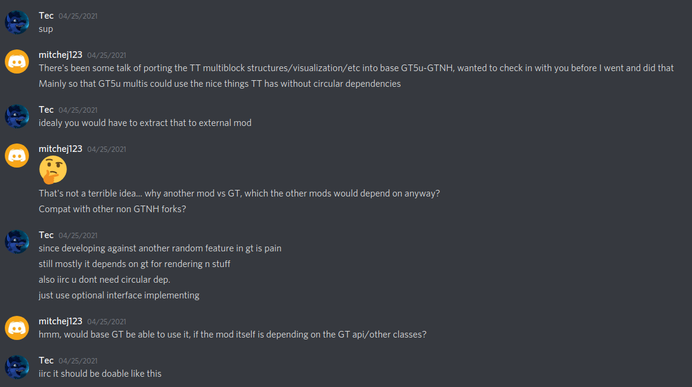

# StructureLib

A standalone version of [TecTech structure api](https://github.com/GTNewHorizons/TecTech/tree/master/src/main/java/com/github/technus/tectech/mechanics/structure).

Originally created by TecTech authors, taken with permission. It's under MIT license anyway.

